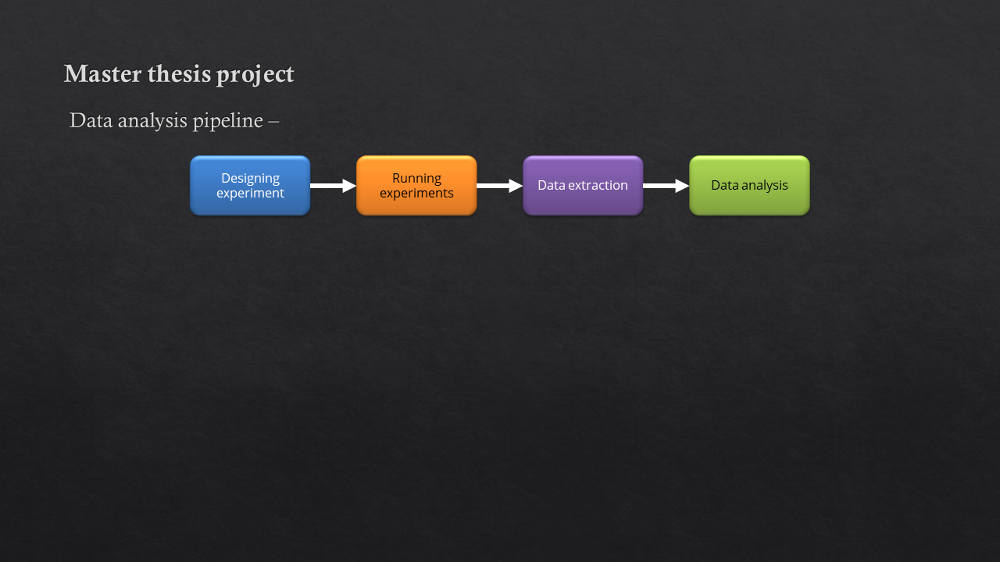
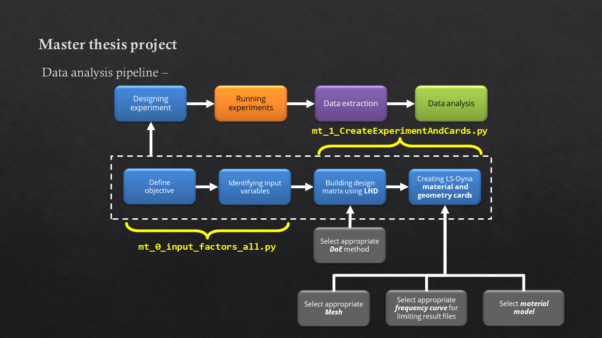
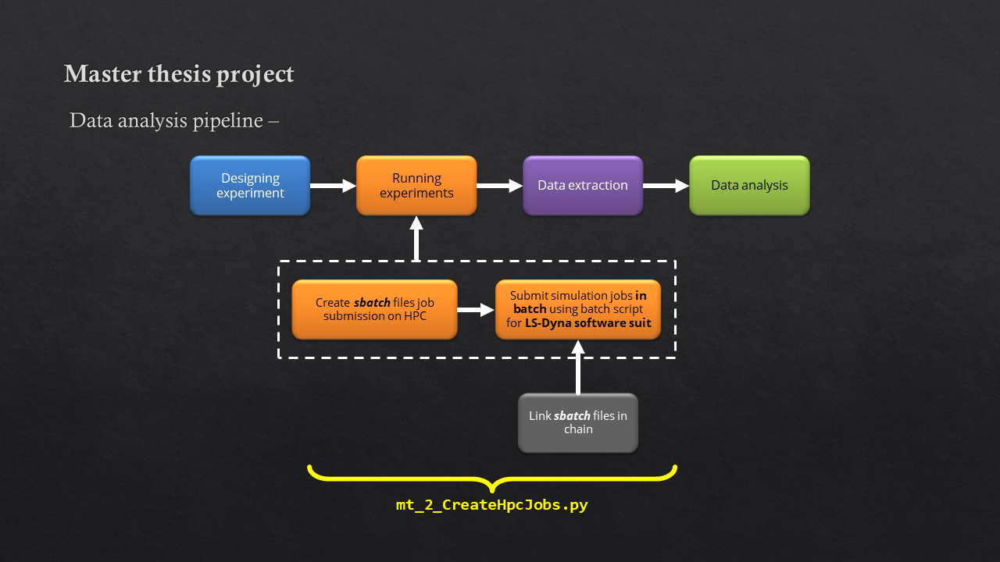
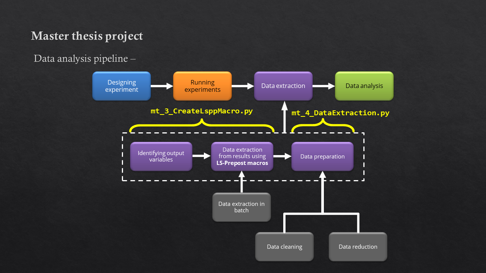
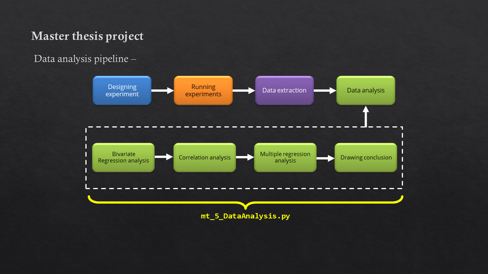

# MasterThesisCMS [](https://zenodo.org/badge/latestdoi/359851831)
Repository for all the code used in completing master thesis:
>*Analysis of the Failure Behaviour of Carbon Fibre Reinforced Polymer Open Hole Tensile Test Specimens*

## Project folder structure
```
.
├── LICENSE
├── README.md
├── default_cards
│   ├── default_geometry.k
│   └── default_material.k
├── mt_0_input_factors_all.py
├── mt_1_CreateExperimentAndCards.py
├── mt_2_CreateHpcJobs.py
├── mt_3_CreateLsppMacro.py
├── mt_4_DataExtraction.py
├── mt_5_DataAnalysis.py
├── project_documentation
│   ├── MasterThesis_Defense_Presentation.pptx
│   ├── MasterThesis_Report.pdf
│   ├── d1.PNG
│   ├── d2.PNG
│   ├── d3.PNG
│   ├── d4.PNG
│   ├── d5.PNG
│   └── d6.PNG
├── tree.txt
└── utilities
    ├── mt_x_OHT_StructuredMesh_GmshLsdyna.py
    ├── mt_x_lsppMacro.py
    ├── mt_x_mainKeywordString.py
    ├── mt_x_projectUtilities.py
    └── output_curve_analysis.xlsx
```

## Thesis details


* The description of the thesis can be found in:
    * [MasterThesis_Defense_Presentation](./project_documentation/MasterThesis_Defense_Presentation.pptx)
    * [MasterThesis_Report](./project_documentation/MasterThesis_Report.pdf)

##  Workflow








